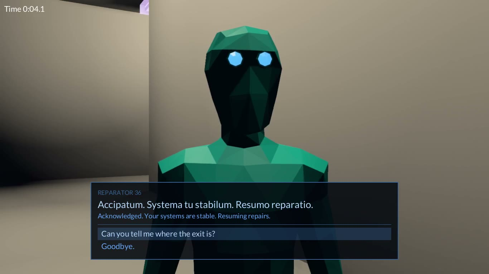

# Maze

A small maze game in Rust, built on the [Fyrox](https://github.com/FyroxEngine/Fyrox)
engine and rendered with Vulkan.

Every round is a new maze, put together at random from four tile models: a straight pipe, a
corner, a T and a crossroads. You start at one end of the longest route through it, and a
glowing exit waits at the other end. The clock runs until you reach it.

[](media/talking_to_a_droid.mp4)

*Talking to one of the droids. Click the picture to watch the video.*

**[Play it in the browser](https://d4140n-4h3-1.github.io/MazeGame-web/)** - no install, a desktop
browser with WebGL 2 is all it needs.

- Random mazes of any size, with loops, built from tiles whose shapes are measured from the models
  themselves.
- A droid to play as, seen from behind over its shoulder, that walks, runs, sprints and crouches
  with you, as fast as its feet carry it. V switches to seeing through its eyes; holding the
  middle mouse button swings the camera round it.
- Other droids living in the maze, wandering its corridors on their own, that can be talked to
  as in Fallout 3. They speak System Latin. Fail to fool a sentry and it hunts you down, Metal
  Gear style: break its line of sight and it searches for you; other sentries that see the
  chase join in; the pistol can stop it.
- Movement with walking, running and a breath-limited sprint, crouching, crawling,
  jumping, taking cover and leaning round corners, and looking behind.
- Ray-traced shadows from every lamp, refractive glass, floor reflections and ambient occlusion.
- Only what can be seen from where you stand is drawn and lit, so big mazes stay fast.
- A pause menu, with a switch that turns every light in the maze off and leaves you with your
  flashlight.

## Requirements

- **A graphics card with Vulkan.** The game checks at startup that it is rendering with Vulkan,
  and exits if it is not. Ray tracing is used for shadows when the card supports it; without it
  the game falls back to shadow maps.
- **Rust 1.94 or newer**, the version the engine requires.
- **`git`, and a network connection for the first build.** Cargo downloads the engine and its
  effects by itself, straight from GitHub, so all there is to get is this project:

  ```sh
  git clone https://github.com/d4140n-4h3-1/MazeGame.git
  cd MazeGame
  cargo run
  ```

  The engine fork is about 400 MB. `.cargo/config.toml` has Cargo fetch it with the system `git`
  rather than its own library, which can resume an interrupted download instead of starting it
  over. `Cargo.lock` pins the commits used; `cargo update` moves to the latest of each branch.

  The engine is modified, so upstream Fyrox will not do: the
  [`vulkan` branch of this fork](https://github.com/d4140n-4h3-1/Fyrox/tree/vulkan) makes the
  wgpu backend render like the OpenGL one and adds the hardware ray tracing that the traced
  shadows use. `VULKAN.md` in the fork describes every change.
  [`fyrox-gfx`](https://github.com/d4140n-4h3-1/fyrox-gfx) holds the graphics effects the game
  adds on top of the engine.

This project is a Cargo workspace of its own. That keeps other crates from switching on the
engine's OpenGL backend, which it would otherwise pick over Vulkan.

## What's changed

### The engine, compared with upstream Fyrox

The fork's `vulkan` branch is two commits on top of upstream Fyrox as of 13 September 2026:

1. **Make the wgpu (Vulkan) backend render like the OpenGL one.** Fixes found by rendering the
   same scenes on both backends and comparing the frames:
   - clip depth is remapped to wgpu's range;
   - textures sampled from projected positions (shadows, SSAO, decals, rendered cube maps) and
     UI rendered into textures are no longer upside down;
   - light volumes and bloom line up with the G-buffer;
   - a GPU hang from stale uniforms is fixed, and integer vertex attributes, pipeline caching,
     scissors, readback padding and rendering into mip levels are corrected;
   - uniform pages are capped at 1 MB, where a 2 GB limit reported by the driver froze loading.

   The `fyrox` crate also stops pulling in the OpenGL backend by default, so choosing
   `backend_wgpu` takes effect.
2. **Add hardware ray-traced shadows and further wgpu fixes.**
   - Hardware ray tracing, where the graphics card has it, traces every light's shadows. It is off
     unless a game asks for it.
   - Point and spot lights are drawn only over the part of the screen they can reach.
   - The soft-shadow filter no longer leaves a hard edge, on both backends.
   - With FXAA off, the frame is no longer upside down.
   - glTF meshes without a material come out plain white instead of dark white metal.
   - Animations saved by older engine versions load their property paths.

`VULKAN.md` in the fork explains each change in detail.

### fyrox-gfx

Graphics effects the game adds on top of the engine, kept out of it: refractive glass, softer
shadow edges, temporal anti-aliasing, further-reaching ambient occlusion, screen-space
reflections, a budget that keeps shadow maps for the nearest lamps only, and the ray-traced
shadows (its `raytracing` feature).

### The game

26 September 2026:

- **A computer to hack, as in Welcome to the Game.** A monitor and keyboard float against a wall
  a few steps from where you start, the monitor's frame glowing red while it is locked. Close to
  it and in front of it, `Computer` and `E) Hack` show under the middle of the screen; E takes
  the view in close, square on to the screen, and a terminal in green text comes up over it,
  as big as the screen is in the view. Enter starts a breach: six commands, one at a time, each
  to be typed exactly into the box under the output before its trace runs out, 15 seconds for
  each. A wrong key does not go in, costs half a second, flashes `ERR` and jolts the
  terminal, and the trace bar flashes once it is nearly out. If the trace completes first,
  access is denied and Enter tries again at once; all six typed, access is granted and the
  frame glows blue. Tab walks away. The clock keeps running, and the droids keep going about
  their business, while you type. For now it opens nothing: it is there to try the hacking out.
  The model is `data/computer.glb`, made from `unlockables/computer.blend`; the terminal is in
  DejaVu Sans Mono (`data/fonts/`).
- **Shot down, droids fall limp**, as ragdolls: every part of the body falls as the physics has
  it, knocked back by the bolt, and a bolt that hits one lying there shoves it. A few seconds
  later the droid is gone.
- **Bolts break droids apart - no blood, just broken geometry.** The bolt that brings a droid
  down, or any bolt that hits one lying there, breaks off the part it hits: its head, an arm at
  the shoulder or the elbow, a leg at the hip or the knee (a hand breaks at the elbow, a foot at
  the knee). The part falls away by itself, both broken ends showing the torn shell and the
  glowing green voxels inside, and a handful of loose voxels spill out of them and bounce across
  the floor.
- **Running at the ready.** With the pistol held low, the droid's left arm pumps as it runs,
  its shoulders twist against its hips with each stride, and the pistol bobs, the muzzle dipping
  as each landing drops the hips.

25 September 2026:

- **Talking to the droids, as in Fallout 3.** Close to a droid and facing it, its name shows under
  the middle of the screen with `E) Talk`. E starts talking: the droid stops and turns to you,
  yours turns to it, and the camera leaves its shoulder for a close-up of the droid's face, the
  view narrowed as with a long lens. What it says runs along the bottom of the screen in a green
  panel, in System Latin with the English under it, and under that the replies. Pick one with
  the mouse, with W and S or the arrows and then E, Enter or Space, or with its number; Tab walks
  away. A reply can be a Speech check (`[Speech 40%]`), which goes one way if it succeeds and
  another if it fails, and can be tried only once. Replies already given are dimmed. The clock
  stops while you talk.
- **Three kinds of droid**, each with its own code: a sentry (Defendator), a scout (Explorator)
  and a maintenance unit (Reparator), in turn. Talk the scout or the sentry round and it tells
  you how far off the exit is and which way, as the crow flies. What they say is in
  `data/dialogue/droids.json`, which can be rewritten without a rebuild. Every line parses with
  the System Latin parser in `data/system_latin/`.
- **The droids speak.** Each line is said out loud in a voice made from formants, as the pistol's
  sounds are, heard from the droid's face. System Latin is read as it is written, each sound
  gliding into the next, each word a moment apart and each vowel on a note of its own, falling
  at the end of a sentence and rising at a question. The sentry speaks low and slow, the scout
  high and quick, and the maintenance unit breathily; every droid a little higher or lower than
  the rest of its kind. The sounds and voices are in `data/sounds/voice_formants.json`, which
  can be retuned without a rebuild. A line is cut off by the next one, or by walking away.
- **The close-up looks level and square on at the droid's face**, from low enough that the
  face is up above the conversation at the bottom of the screen.
- **Moods.** The conversation's panel takes the colour of how the droid feels about what it is
  saying: green as usual, blue for success, yellow for a warning or a question, orange for
  agitation or a failed Speech check, and red when it is hostile. Each line in
  `data/dialogue/droids.json` can say its own; one that does not is blue after a check that
  succeeded, orange after one that failed, and green otherwise.
- **The eyes go with the mood too**: the droid being talked to has its eyes glow the panel's
  colour, and their own green again as usual and once the conversation is over. The colour
  they glow as usual, and how brightly, is the model's own `eye_glow` material.
- **The voice goes with the mood**: higher when pleased, questioning or agitated, lower when
  hostile, as `moods` in `data/sounds/voice_formants.json` has it.
- **Pausing stops the sound too**: a droid's line, the pistol and its bolts carry on from where
  they were once the game is resumed.
- **Always someone to talk to.** One of the droids stands just in front of you at the start of
  each round, facing you, and stays there rather than wandering off, even once you have talked
  to it.
- **Sentries turn hostile.** Fail the sentry's Speech check to pass as a maintenance unit, and it
  orders you out of its zone, in orange; walk away and that is the end of it, but refuse and it
  says "You are an intruder. Prepare for deletion." in red. Fail to send it after something
  behind you, and it sees through you and says the same. Its eyes stay red, it cannot be
  talked to any more, and once the conversation is over, a moment later it comes after you at
  a run, and hunts you as below. If it catches you,
  you are deleted, and a new maze begins a few seconds later. Three bolts from the pistol stop
  it: it goes down in a crouch, its eyes dark, and stays there. A line in
  `data/dialogue/droids.json` with `"attacks": true` has its droid do this.
- **Stealth, as in Metal Gear.** A hostile droid goes through Metal Gear's phases, shown in the
  status line and in its eyes:
  - **ALERT** (red eyes): it can see you, and runs at you.
  - **EVASION** (orange), with the seconds of searching it has left: it has lost you. It runs to
    where you were heading when it last saw you and looks about, then walks from one spot to
    another nearby, looking about at each, for 30 seconds.
  - **CAUTION** (yellow), with the seconds left: it has given up, and wanders, still watching
    for you. After a minute it calms down, its eyes go back to green, and it can be talked to
    again.

  Out of ALERT it sees only what is in front of it, 55 degrees either way, and 30 m off
  standing, half as far crouched and under a third as far crawling; right next to it, it
  notices you whichever way it faces. Seeing you in any phase puts it back on ALERT. A bolt
  that hits it without it seeing you has it search where you fired from. As it spots you,
  loses you and gives up, it says so out loud: "Intrusor detectum. Sta." ("Intruder detected.
  Halt."), "Intrusor perdatum. Zeto intrusor." ("Intruder lost. Searching for the intruder.")
  and "Phantasma. Resumo patrolium." ("A sensor ghost. Resuming patrol."), with subtitles
  under the status line. These are the sentry's `barks` in `data/dialogue/droids.json`.
- **Sentries join a chase.** A sentry that sees another sentry on ALERT, running after you, goes
  after you too, calm or not: the one it sees shows it where you are. It sees the other as it
  would see you standing there - in front of it out of ALERT, less far with the lights off -
  and a calm one stands a second before it sets off, as one does that has just turned hostile.
  A sentry that sees one that has joined in joins in as well. Once it sees neither you nor
  anyone after you, it searches where you were, as usual.
- **Noise.** Out of ALERT, a hostile droid listens as well. Walking, crouching and crawling are
  silent; running is heard 5 m off, sprinting 10 m, landing hard from a fall 6 m, a pistol shot
  12 m and a bolt hitting something 8 m - measured along the corridors, so a wall between you
  muffles it. A droid that hears you says "Quid? Sonus detectum. Verifico." ("What? A sound
  detected. Checking."), runs to where the noise was and searches from there, and pays no heed
  to another noise for 3 seconds. A bolt fired into a wall away from you makes a distraction.
- **Darkness.** With the lights off, a droid sees only about a third as far, whichever phase it
  is in - unless your flashlight is on, which gives you away as if the lights were on.
- **The crosshair is always there.** The pistol's screen, crosshair and all, shows the whole
  time the pistol is out, rather than only for a moment as it fires; each pull of the trigger
  now flashes it brighter, the crosshair with it. The crosshair's marks keep the model's own
  solid green glow instead of being turned into glass with the screen, and the screen's glass no longer mirrors its
  surroundings or catches highlights from lights: only what is seen through it, and its glow.
- **Don't point that at me.** Every droid minds having the pistol pointed at it - the middle
  of the view on it, within 20 m, with the pistol out. Keep it there and the droid stops, turns
  to face you and warns you, its eyes yellow. Each warning then holds 2.5 seconds longer than
  that, for it to be said and taken in, before the next: the last warning, its eyes orange, and
  then being provoked. Sentries are the least patient, warning you after 0.8 seconds, again at
  4.1 and provoked at 7.4, and provoked, they come after you ("Aggressor detectum.
  Deletabso tu." - "Attacker detected. I will delete you."). Scouts and maintenance units
  warn you after 2 seconds, again at 6.5 and provoked at 11, and then sound the alarm ("Aggressor detectum. Sireno."):
  every sentry within 40 m that is not already after you comes to search where you are
  ("Sirenatio accipatum. Zeto aggressor." - "Alarm received. Searching for the attacker.").
  Looking away only holds the next stage off; lower the pistol or keep it off a droid for 2.5
  seconds and it calms down ("Accipatum."). Shooting a droid provokes it at once. How patient each kind is, and what it
  does, is its `threatened` in `data/dialogue/droids.json`, and what it says are its `barks`.
- **The pistol in first person, as in Call of Duty.** Seen through the droid's eyes, the pistol
  is held in view, low and to the right, pointing in at the middle of the view. Holding the
  right mouse button raises it into the middle to aim, its screen - crosshair and all - square
  in the middle of the view like a sight. It comes up from below as it is drawn and goes back
  down as it is holstered, kicks back and up with each shot, and tucks down out of the way
  right up against a wall; the ball at its muzzle tumbles and its screen flashes as the
  droid's own do. In first person a shot leaves its muzzle for whatever the middle of the view
  is on.
- **A bolt shows where it hits.** It stops with its tip against whatever it hit and glows there
  a moment, lighting it up, rather than going out a step short of it.

24 September 2026:

- **A pistol.** R draws the droid's pistol and holsters it again; the left mouse button draws it
  too, and once it is drawn fires it. Drawn, the droid aims ahead and strafes as with the right
  mouse button, its upper body in the pistol's poses (`droid_pistol_draw`, `_aim`, `_fire`,
  `_holster`) while its legs walk, run or stand as ever. The pistol shows and goes partway
  through the draw and the holster, as `data/droid_motion.json` says, and is out of sight in
  its hand until then. Drawn, it is held lower, at the ready (`droid_pistol_ready`); holding
  the right mouse button raises it to aim, and a shot from the ready raises it, fires as soon as
  it is up and lowers it again a second after the last shot. Raised or at the ready, the pistol
  follows the camera: the droid's upper body leans it
  up, down and round towards wherever the camera looks, up to 60 degrees each way, blending the
  model's aims (`droid_pistol_aim_*`, laid out in `droid_motion.json`). A shot is a glowing bolt
  from the muzzle that flies the way the gun points and stops at the first thing it hits,
  harming nothing yet. The
  bolt is green and carries a green light with it, lighting up the droid as it leaves and
  everything it passes in the dark. The pistol's screen, see-through green glass, flashes with
  each pull of the trigger; the ball at its muzzle - a glowing core in a see-through green
  shell - shows all the while the pistol is out, the core and the shell tumbling every way
  round, each the opposite way to the other.
- **Square to the front.** Strafing, or with the pistol drawn, the droid's face and shoulders
  stay square to straight ahead, however its hips turn to the way it steps.
- **N for a new maze**, since R is the pistol's now.
- **Over the right shoulder.** The camera sits closer and further out to the droid's right, as in
  Fallout: the droid stands to the left of the view, the way ahead clear on the right. It had
  been over the left shoulder. Holding the right mouse button brings it in closer, to aim over
  the shoulder, and letting go takes it back out. Holding the middle mouse button to swing the
  camera round and look at the droid leaves the droid as it was: its pistol no longer follows
  the camera round.
- **Head bob in first person.** Seen through the droid's eyes, the head rises and falls in step
  with the stride again, and fades out on going over to the view from behind.
- **The pistol sounds.** A shot cracks at the muzzle, and each bolt hums as it flies. The sounds
  are made from formants when the game starts - a buzz and noise shaped by resonances, as a
  voice is - described in `data/sounds/pistol_formants.json`, which can be retuned without a
  rebuild; `src/formants` makes them. What sounds is heard from the camera.
- **The flashlight starts off.** F switches it on.

23 September 2026:

- **Strafing.** Holding the right mouse button keeps the droid facing ahead whichever way it goes:
  it steps sideways, back and along every diagonal in its new strafes (`droid_strafe_walk_*`,
  `droid_strafe_run_*` and `droid_strafe_crouch_*`, crouched or crawling, each `_L`, `_R`,
  `_FL`, `_FR`, `_B`, `_BL` and `_BR`), turning only a few degrees whichever way it goes.
  Strafing, a sprint slows to a run, picking up again once the button is let go, and the droid
  does not skid. In cover the
  wall still sets which way it faces.
- **Skids of every kind, sprinting only.** Sprinting flat out, the droid skids round
  (`droid_skid_sprint_turn_L`/`_R`) and runs out through the run, cuts across a quarter turn
  (`droid_skid_sprint_turn90_L`/`_R`), and let go of, slides to a standstill
  (`droid_skid_sprint_stop`) and idles. Running, it no longer skids at all. Whether it is
  sprinting goes by how fast it is going, not the keys held. The skids are made on the spot, and `data/droid_motion.json`, exported along with them,
  has where each takes the droid and how far round: the body follows that path, as far as it
  goes for how fast the droid went in, and the droid swings round with it.

22 September 2026:

- **A droid to play as.** The player is seen from behind as a droid (`data/droid_full_deform.glb`),
  with the camera over its shoulder and pulled in when a wall is in the way. V switches to first
  person, and holding the middle mouse button swings the camera round the droid.
- **Its feet set the speed.** Walking, running, sprinting and crouching each play the droid's own
  cycle, and each gait goes as fast as that cycle's stride, so the feet stay on the floor. That
  makes every gait slower than before.
- **It faces the way it goes, and skids round.** The droid turns to face whichever way the keys
  send it, and stands idling when still. Turning round at a run or a sprint, it skids to a stop,
  swings round and sets off the other way.
- **It jumps, low or high.** Tap Space for a low jump, hold it for a high one; each press jumps
  once. From standing still the droid springs straight up and lands on the spot; on the move it
  leaps in its stride and lands running. It lands hard from a high jump or a long drop, lightly
  otherwise, and falling off an edge it flies and lands the same way.
- **Inhabitants.** Six more droids live in the maze, made from the same model. Each wanders off
  somewhere, keeping to the middle of the corridors, idles a while when it gets there, and sets
  off again. They are solid and make way for each other: walking, they veer to their right round
  whoever is ahead, and standing about, they step aside for anyone coming straight at them.
  `MAZE_INHABITANTS` sets how many.
- **Cover.** Tab puts the droid up against the wall ahead. A and D then slide it along the wall,
  facing the way it goes, as far as the wall's edge - the corner to take cover behind. Holding A
  or D on past the edge leans out round the corner; Ctrl no longer leans. Tab again, pushing away
  from the wall, or jumping leaves cover. Until there are cover animations (`droid_cover_idle`,
  `droid_cover_walk`, picked up once the model has them) it idles and walks as usual.
- **No more head bob** from behind. The camera is held steady; the droid's cycles show the stride.
- The droid is not yet in the traced shadows, which are gathered once and would leave its shadow
  where it started.

19 September 2026:

- **Pause menu.** Escape now opens a menu with Resume, Lights, New maze and Quit, and stops the
  clock, the player and the physics. It used to only release the mouse. A round in play also
  pauses when the window loses focus.
- **Lights switch.** From the pause menu, the lamps, the glow of their fixtures, the sun and nearly
  all the ambient light can be turned off, leaving the flashlight to see by. The setting carries
  over to each new maze.
- **The end-of-round banner** is now centred on the window.
- **The code is split into modules** - `game`, `level`, `culling`, `fixtures`, `survey`, `hud`,
  `menu`, `diagnostics` and a `player/` folder - instead of one large `main.rs` and
  `player.rs`. Nothing about how the game plays changed with it.

## Running

```sh
cargo run
```

It can be started from anywhere; it finds its models in `data/` next to `Cargo.toml`. The engine
is compiled with optimizations even in a debug build, and the game itself is not, so `cargo run`
is quick enough to play while still easy to debug. `cargo run --release` optimizes the game as
well.

### In a browser

```sh
rustup target add wasm32-unknown-unknown
cargo install wasm-bindgen-cli --version <the wasm-bindgen version in Cargo.lock>
./web/build.sh
python3 -m http.server -d site
```

`web/build.sh` builds the game to WebAssembly and puts it in `site/` with the page and `data/`,
ready to serve as it is; open http://localhost:8000 and press Play. In a browser the game draws
with WebGL 2, the one graphics API every browser has, and so shadows come from shadow maps: no
browser offers ray tracing. The published copy lives in
[MazeGame-web](https://github.com/d4140n-4h3-1/MazeGame-web), which serves `site/` on GitHub
Pages.

## Controls

| Key              | Action                                                        |
| ---------------- | ------------------------------------------------------------- |
| W A S D, arrows  | Move                                                          |
| Mouse            | Look around                                                   |
| Caps Lock        | Walk or run; it stays as you left it                          |
| Shift (hold)     | Sprint. Costs breath, and running out leaves you walking      |
| Space            | Jump: tap for a low jump, hold for a high one                 |
| C                | Crouch, or stand back up                                      |
| Z                | Crawl, or stand back up                                       |
| Q (hold)         | Look behind you while still moving forward                    |
| Tab              | Take cover against the wall ahead, or leave it                |
| A / D in cover   | Slide along the wall; hold on past its edge to lean round it  |
| F                | Flashlight on or off (it starts off)                          |
| V                | Third person (behind the droid) or first person               |
| Middle mouse (hold) | Swing the camera round the droid to see it from any side    |
| Right mouse (hold) | Strafe: keep facing ahead whichever way you go; Shift only runs |
| R                | Draw the pistol, or holster it                                |
| Left mouse       | Draw the pistol; once it is drawn, fire                       |
| Right mouse, drawn | Raise the pistol to aim, rather than hold it at the ready   |
| E                | Talk to the droid close by and in front of you, or use the computer in front of you |
| Talking: mouse, W / S, arrows | Pick a reply; E, Enter, Space or a click says it  |
| Talking: 1 to 9  | Say that reply                                                |
| Talking: Tab     | Walk away                                                     |
| Computer: Enter  | Start a breach, or try again once denied                      |
| Computer: typing | Type the command shown, exactly                               |
| Computer: Tab    | Walk away                                                     |
| N                | New maze                                                      |
| `[` `]`          | Turn slower or faster                                         |
| `-` `=`          | Narrower or wider view                                        |
| Escape           | Pause                                                         |

### Pause menu

Escape pauses the game: the clock, the player, the physics and every sound all stop, sounds
carrying on from where they were once it is resumed. Switching to another
window in the middle of a round pauses it too. The menu has:

- **Resume**: carry on where you left off.
- **Lights**: switch the maze's lights off, or back on. Off, the lamps, the glow of their
  fixtures, the sun and nearly all the ambient light go out, leaving your flashlight and the
  exit's own glow. The setting carries over to each new maze.
- **Options**: switch the subtitles of what the droids say on or off, the System Latin and the
  English each by itself. With only the English on, it is as big as the System Latin would be.
  Back, or Escape, returns to the menu.
- **New maze**: the same as N. **New round** when playing a fixed maze model.
- **Quit**.

## Options

Options are set with environment variables, for example `MAZE_SIZE=10x10 cargo run`. In the
browser, add them to the page's address instead:
`https://d4140n-4h3-1.github.io/MazeGame-web/?MAZE_SIZE=10x10&MAZE_SEED=7`. What `MAZE_DEBUG`
logs goes to the browser's console there.

| Variable                 | Effect                                                                  |
| ------------------------ | ----------------------------------------------------------------------- |
| `MAZE_SIZE=<w>x<d>`      | How many junctions wide and deep the maze is. The default is `20x20`.   |
| `MAZE_SEED=<n>`          | Makes every maze and round the same, for comparing two runs.            |
| `MAZE_MODEL=<path>`      | Plays a fixed maze model (`.glb`, `.gltf` or `.fbx`) instead of random mazes. |
| `MAZE_INHABITANTS=<n>`   | How many droids live in the maze. The default is 6.                     |
| `MAZE_DEBUG=1`           | Logs the walkable map of each level, and rendering statistics once a second. |
| `MAZE_WINDOWED=1`        | Opens the game in a window instead of filling the screen.               |
| `MAZE_VSYNC=0`           | Uncaps the frame rate, for measuring what a frame costs.                |
| `MAZE_RT=0`              | Shadow maps instead of ray-traced shadows.                              |
| `MAZE_HARD_SHADOWS=1`    | Ray-traced shadows with sharp edges instead of soft ones.               |
| `MAZE_SHADOW_BUDGET=0`   | With shadow maps, gives every lamp in range one, not just the nearest.  |
| `MAZE_SSAO=0`            | Turns ambient occlusion off.                                            |
| `MAZE_REFLECTIONS=0`     | Turns floor reflections off.                                            |
| `MAZE_KNOCKDOWN=<s>`     | That many seconds into a round, shoots down the droid nearest you, to try the ragdolls out. |
| `MAZE_DISMEMBER=<parts>` | With `MAZE_KNOCKDOWN`, breaks those parts off it too, such as `head,forearm.L,shin.R`. |
| `MAZE_COMPUTER=1`        | Puts you at the computer, using it, as soon as it is placed; `breach` starts a breach too. |

### Fixed maze models

A model given with `MAZE_MODEL` needs no special structure, but the game reads a few things from
it:

- Surfaces colored **pure magenta** (255, 0, 255) are the glass of light fixtures. They become
  refractive glass, and each fixture gets a lamp.
- Small meshes standing on their own, narrower than 3.5 m, are taken as **something to find**:
  the round ends there instead of at a random exit.
- FBX models are taken to be in centimeters and scaled down.

Anything in the model that glows by itself goes dark with the lights.

## Tests

```sh
cargo test
```

The tests cover maze generation and tile fitting, what can be seen from where, the walkable grid
and round planning, the player's movement, breath, head motion, leaning and keys, the ragdoll and
how a droid comes apart, and the computer's hack and where it goes.

## How it fits together

| Module          | What it does                                                               |
| --------------- | -------------------------------------------------------------------------- |
| `main.rs`       | Starts the engine and sets up the graphics effects.                        |
| `game.rs`       | The game: loading levels, rounds, input, the pause menu, the lights.       |
| `level.rs`      | A level in the scene: its pieces, collider, lamps and walkable ground.     |
| `generate.rs`   | Plans random mazes on a grid of junctions and turns them into tiles.       |
| `tiles.rs`      | Measures the tile models and assembles a maze from them.                   |
| `layout.rs`     | The walkable grid, and where a round starts and ends.                      |
| `survey.rs`     | Finds the walkable ground of a level by casting rays into it.              |
| `culling.rs`    | Hides the pieces and lamps that cannot be seen from where the player is.   |
| `fixtures.rs`   | Light fixtures: the glass, the lamps, and everything that glows.           |
| `inward.rs`     | Makes the tiles' surfaces visible from inside and out.                     |
| `hud.rs`        | The status line and the banner.                                            |
| `menu.rs`       | The pause menu.                                                            |
| `computer.rs`   | The computer to hack: where it goes, the hack, and its terminal.           |
| `ragdoll.rs`    | A droid gone limp: its bodies and joints, from `data/droid_motion.json`.   |
| `dismember.rs`  | Breaking a droid apart: its pieces and broken ends, and the voxels that spill. |
| `dialogue/`     | Talking to the droids: their conversations from `data/dialogue/`, and the panel they are shown in. |
| `diagnostics.rs`| The Vulkan check and the rendering statistics.                             |
| `formants/`     | Sounds made from formants: the file format, the synthesizer that makes the pistol's sounds from `data/sounds/`, and the droids' speech. |
| `player/`       | The player, one file per part: posture, movement, breath, head, lean, input, view, the droid (`avatar`), the camera behind it (`third_person`) and its close-up when talking (`talk`). |

The tile models, the droid (`droid_full_deform.glb`) and the computer (`computer.glb`) are in
`data/`, along with where the droid's skids take it, its ragdoll and how it comes apart
(`droid_motion.json`), and the terminal's font (`fonts/`, DejaVu Sans Mono, under its own
license in `fonts/DejaVuSansMono.LICENSE`).

## License

Copyright (c) 2026 VulpesPhantasma ([d4140n-4h3-1](https://github.com/d4140n-4h3-1) on GitHub).

The code is under the MIT license (`LICENSE-MIT`). The models, animations and other files in
`data/` are under Creative Commons Attribution-ShareAlike 4.0 International (`LICENSE-CC-BY-SA`):
share and adapt them, crediting VulpesPhantasma (d4140n-4h3-1), with anything made from them
shared under the same license.
